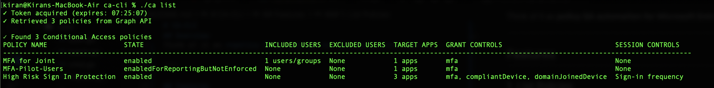
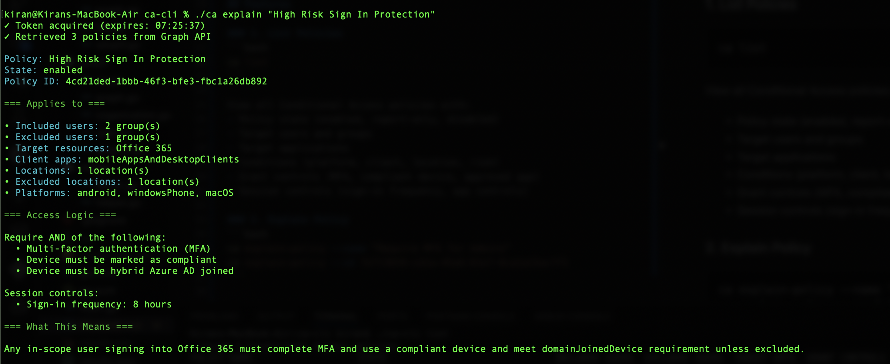
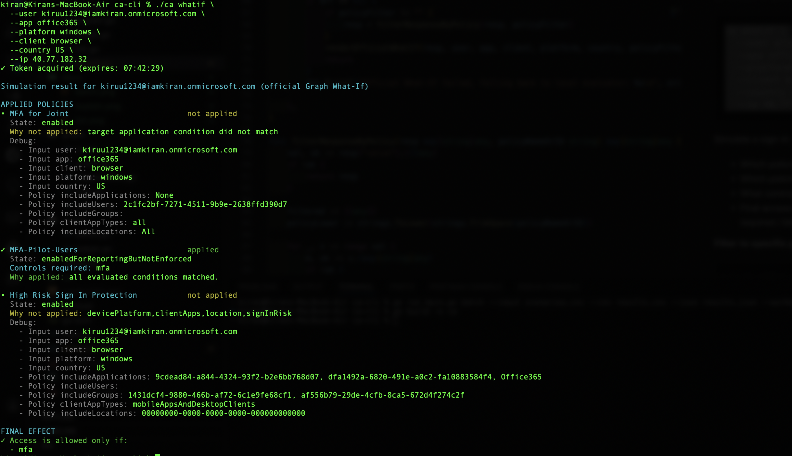
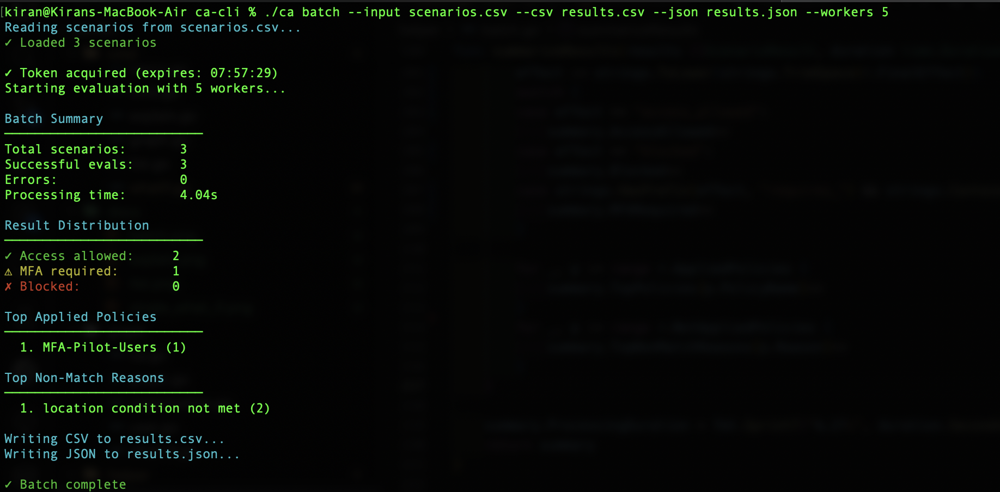

# CA-CLI

A powerful command-line tool for Microsoft Entra Conditional Access policy analysis, simulation, and testing.

## Overview

CA-CLI helps IAM engineers and administrators validate, test, and understand Conditional Access policies through:

- **Policy Analysis**: List and explain policies in human-readable format
- **What-If Simulation**: Test sign-in scenarios against policies
- **Batch Testing**: Run hundreds of scenarios concurrently for regression testing


Think of it as **policy QA automation for Microsoft Entra ID**.

---

## Features

### 1. List Policies
```bash
ca list
```



View all Conditional Access policies with:
- Policy state (enabled, report-only, disabled)
- Target users and groups
- Target applications
- Conditions (platform, client, location, risk)
- Grant controls (MFA, compliant device, approved app)
- Session controls (sign-in frequency, app controls)

### 2. Explain Policy
```bash
./ca explain "High Risk Sign In Protection"
```



Deep-dive into a single policy with detailed conditions and controls.

### 3. What-If Simulation
```bash
./ca whatif \
  --user kiruu1234@iamkiran.onmicrosoft.com \
  --app office365 \
  --platform windows \
  --client browser \
  --country US \
  --ip 40.77.182.32

```



Simulate a sign-in scenario and see:
- Which policies apply
- Which policies don't apply (and why)
- What controls are required
- Final access decision (allowed / MFA required / blocked)

**Filter to specific policy:**
```bash
./ca whatif \
  --user kiruu1234@iamkiran.onmicrosoft.com \
  --app office365 \
  --platform windows \
  --client browser \
  --country US \
  --ip 40.77.182.32
  --policy "MFA-Pilot-Users"
```

### 4. Batch Testing
```bash
ca batch --input scenarios.csv --csv results.csv --json results.json --workers 10
```



Run bulk What-If evaluations for regression testing and policy validation.

**Input CSV format:**
```csv
scenario_id,user,app,platform,client,country,ip,policy
TC-001,alice@contoso.com,office365,windows,browser,US,40.77.182.32,
TC-002,bob@contoso.com,office365,ios,mobile,CA,52.12.10.1,MFA-Pilot
TC-003,charlie@contoso.com,salesforce,android,mobile,UK,52.212.1.44,
```

**Output includes:**
- Terminal summary (total scenarios, success/fail, top policies)
- CSV report (for Excel analysis)
- JSON report (for integrations)
---

## Installation

### Prerequisites
- Go 1.21+
- Microsoft Entra ID tenant
- App registration with permissions:
  - `Policy.Read.All` (Application)
  - `User.Read.All` (User if wants to use email/UPN instead of GUID)

### Setup

1. **Clone repository:**
```bash
git clone https://github.com/yourusername/ca-cli.git
cd ca-cli
```

2. **Create app registration in Azure:**
   - Go to Azure Portal → Entra ID → App registrations → New
   - Add API permissions: `Policy.Read.All`, `User.Real.All`
   - Grant admin consent
   - Create client secret

3. **Configure credentials:**
```bash
cp credentials.env.example credentials.env
```

Edit `credentials.env`:

```env
CLIENT_ID=your-app-registration-client-id
CLIENT_SECRET=your-client-secret
TENANT_ID=your-tenant-id
```

4. **Build:**
```bash
go build -o ca
```

5. **Run:**
```bash
./ca list
```

---

## Usage Examples

### Validate Policy Before Rollout
```bash
# Test pilot group across platforms
ca batch --input pilot-scenarios.csv --csv pilot-results.csv --workers 5
```

### Exception Testing
```bash
# Test break-glass account
ca whatif \
  --user breakglass@contoso.com \
  --app office365 \
  --platform windows \
  --client browser
```

### Regression Testing
```bash
# After policy change, rerun test suite
ca batch --input regression-suite.csv --json baseline.json --workers 10

# Compare with previous baseline
diff baseline-before.json baseline.json
```


---


## Architecture

```
ca-cli/
├── cmd/              # Cobra commands
│   ├── list_policy.go
│   ├── explain_policy.go
│   ├── whatif.go
│   ├── batch.go
│   └── signin_explain.go
├── graph/            # Microsoft Graph SDK wrappers
│   ├── graphhelper.go
│   ├── what-if.go
│   ├── user.go
│   ├── batch.go
│   └── batch_executor.go
├── helper/           # Utilities
└── main.go
```

**Key design decisions:**
- Uses official Graph What-If API (beta endpoint)
- Concurrent worker pool for batch processing
- User UPN → object ID resolution with caching
- Rate-limit friendly (configurable workers)


## Use Cases

### 1. Pre-Deployment Validation
Test policy against representative user/app/platform combinations before enabling.

### 2. Pilot Analysis
Validate pilot group behavior across scenarios.

### 3. Exception Review
Test VIP accounts, contractors, BYOD devices.

### 4. Regression Testing
Rerun scenario suite after policy changes to detect unintended impacts.

### 5. Incident Investigation
Explain why a specific sign-in failed or succeeded.

---

## Contributing

Contributions welcome! Please:
1. Fork the repository
2. Create a feature branch
3. Add tests for new functionality
4. Submit a pull request

---

## License

MIT License - see [LICENSE](LICENSE) for details.

---

## Acknowledgments

Built with:
- [Microsoft Graph SDK for Go](https://github.com/microsoftgraph/msgraph-sdk-go)
- [Azure SDK for Go](https://github.com/Azure/azure-sdk-for-go)
- [Cobra CLI](https://github.com/spf13/cobra)

---

## Support

- **Issues**: [GitHub Issues](https://github.com/yourusername/ca-cli/issues)
- **Documentation**: [Wiki](https://github.com/yourusername/ca-cli/wiki)
- **Blog**: [Your blog link]

---

## Author

Built by Kiran Adhikari as part of IAM automation tooling.

**Why this exists:**
Conditional Access testing in the Azure Portal is manual and time-consuming. This tool brings developer-style QA automation to IAM policy management.

**Who is this for:**
- IAM engineers validating policy changes
- Security teams doing pre-rollout testing
- Admins troubleshooting sign-in issues
- Anyone managing Conditional Access at scale

